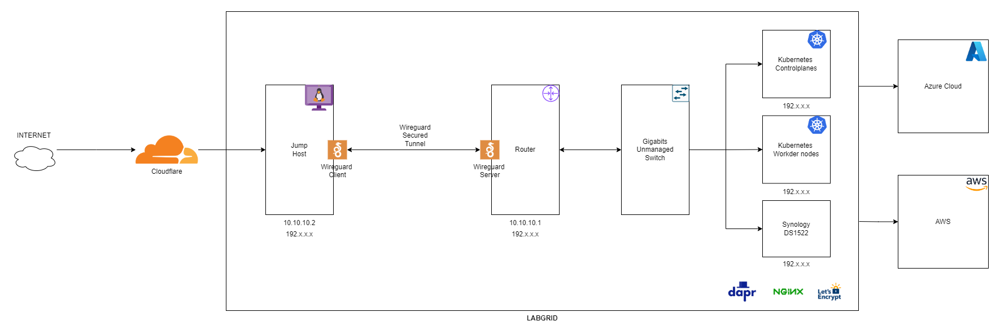

# 🏠 LabGrid

A modern, production-grade Kubernetes infrastructure for running enterprise workloads in a lab environment. Built with K3s, Azure, and GitOps principles.

## 🌟 Features

- **GitOps-Driven Infrastructure**: All infrastructure and application deployments managed through Git
- **Production-Grade Security**: Azure Key Vault integration, OIDC authentication, and secure secret management
- **High Availability**: 10-node K3s cluster with proper redundancy
- **Automated Database Management**: CloudNativePG for PostgreSQL cluster management
- **Modern Storage Solutions**: Synology CSI integration for persistent storage
- **Automated Certificate Management**: Let's Encrypt integration for SSL/TLS
- **Monitoring & Observability**: Prometheus and Grafana for metrics and visualization
- **Automated Backups**: Azure Blob Storage integration for database backups
- **Infrastructure as Code**: Terraform for general infrastructure management
- **Learning Environment**: Dedicated kubeadm cluster for practicing Certified Kubernetes Administrator(CKA) & Certified Kubernetes Security (CKS) exam curriculum

### Hardware

- HP ELITEDESK 800 G2 Intel Core i7 6th Gen/16GB RAM/500GB SSD x 5
- HP ELITEDESK 800 G2 Intel Core i7 6th Gen/16GB RAM/256GB SSD x 4
- GL.iNet GL-MT6000(Flint 2) WiFi 6 Router
- TP-Link 24-Port Gigabit Ethernet Switch (TL-SG1024D)
- Synology DS1522+
- Raspberry Pi 4 8GB RAM + 240GB NVMe M.2 SSD + Argon ONE casing

### Labgrid Network Diagram

### Core Components

- **Production Clusters**: 
  - 10-node High Availability K3S cluster
  - 3 X HP ELITEDESK 800 G2 Intel Core i7 - control plane nodes
  - 6 X HP ELITEDESK 800 G2 Intel Core i7 - worker nodes
  - kubeadm-based cluster on Proxmox for keeping up to date with Kubernetes certification exam curriculum
- **Database Layer**: PostgreSQL clusters managed by CloudNativePG
- **Storage**: Synology NAS integration via CSI driver
- **Networking**: Kube-vip, nginx, wireguard in addition to Kubernetes networking.
- **Security**: Azure Key Vault for secrets management
- **Monitoring**: Prometheus & Grafana stack
- **CI/CD**: GitHub Actions for automation

### Applications

- **n8n**: Workflow automation platform
- **Vikunja**: Task management and to-do list application
- **Linkding**: Bookmark manager for organizing web links
- **IAM**: Identity and access management solution, providing OIDC authentication for cluster  and application accesses powered by Keycloak, PostgreSQL & CloudNativePG
- **pgAdmin 4**: A web based administration tool for the PostgreSQL database 
- **Trilium Next**: Hierarchical note-taking application with advanced features
- **Home Assistant**: Open-source home automation platform for smart home integration
- **Pi-hole**: Network-wide DNS sinkhole and ad blocker
- **Nginx Proxy Manager**: Reverse proxy and SSL certificate management solution
- **Bitwarden**: Secure password manager and digital vault
- **ArgoCD**: GitOps continuous delivery tool for Kubernetes
- **Portainer**: Container management and orchestration platform
- **Prometheus**: Time-series database and monitoring system for collecting and querying kubernetes and application metrics
- **Grafana**: Analytics and visualization platform for creating custom dashboards and alerts
- **Certificate Management**: cert-manager
- **Secret Management**: External Secrets Operator
- **Learning Tools**: Various Kubernetes components for CKA practice

## 🛠️ Infrastructure

Everything needed to run my clusters & deploy my applications

| Component | Description |
|-----------|-------------|
|  | Lightweight Kubernetes distribution powering my 10-node production cluster |
|  | Standard Kubernetes installation tool for my CKA practice cluster on Proxmox |
|  | Database operator for running PostgreSQL clusters with high availability |
|  | NAS storage with CSI driver for persistent volume provisioning |
|  | Cloud platform for Key Vault, networking, and blob storage |
|  | Monitoring system for metrics collection and alerting |
|  | Visualization platform for infrastructure and application metrics |
|  | Primary Infrastructure as Code tool for managing all infrastructure components |
|  | Version control and CI/CD platform for GitOps workflows |

### Storage

- Synology NAS for persistent storage
- CSI driver for Kubernetes integration
- Azure Blob Storage for backups
- NFS shares for shared data

### Security

- Azure Key Vault for secrets management
- OIDC authentication via Keycloak for all Kubernetes cluster access
- Network isolation and segmentation
- Automated certificate management
- Regular security updates via Renovate
- Centralized authentication for all cluster interactions
- Token-based access control for API server communication

## 🚀 Getting Started

### Prerequisites

- Azure subscription
- Azure CLI
- kubectl
- terraform
- helm

## 🔒 Security

- OIDC authentication via Keycloak for all Kubernetes cluster access
- Azure Key Vault for secrets management
- Network segmentation and isolation
- Automated certificate management
- Regular security updates via Renovate
- Centralized authentication for all cluster interactions
- Token-based access control for API server communication

## 🔄 Automation

- Automated infrastructure deployment via Terraform
- GitOps-driven application deployment
- Automated database backups
- Automated dependency updates via Renovate
- Automated certificate renewal

## 📊 Monitoring

- Prometheus for metrics collection
- Grafana for visualization
- Custom dashboards for infrastructure monitoring
- Alert management

## 🤝 Contributing

Contributions are welcome! Please feel free to submit a Pull Request.

## 📝 License

This project is licensed under the MIT License - see the LICENSE file for details.

## 🙏 Acknowledgments

- Inspired by various open-source homelab projects
- Built with modern cloud-native tools and practices
- Community-driven development

---

Made with ❤️ for the Kubernetes community

### Infrastructure as Code

- **Terraform as Primary IaC Tool**:
- **State Management**: Azure Storage for Terraform state
- **Module-based Architecture**: Reusable Terraform modules for consistent deployments
- **Version Control**: All infrastructure code versioned in Git
- **Automated Deployment**: CI/CD pipeline for infrastructure changes
